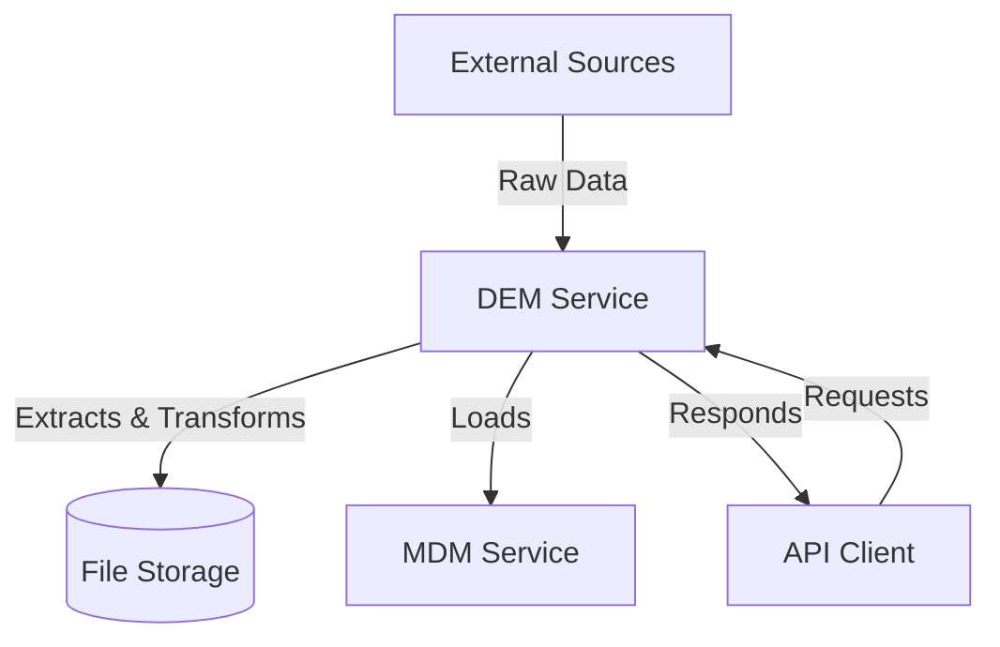
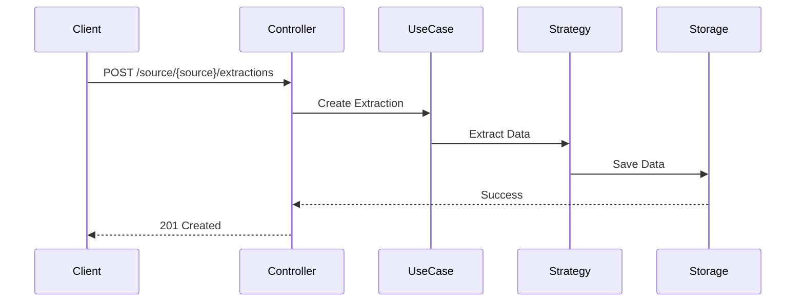
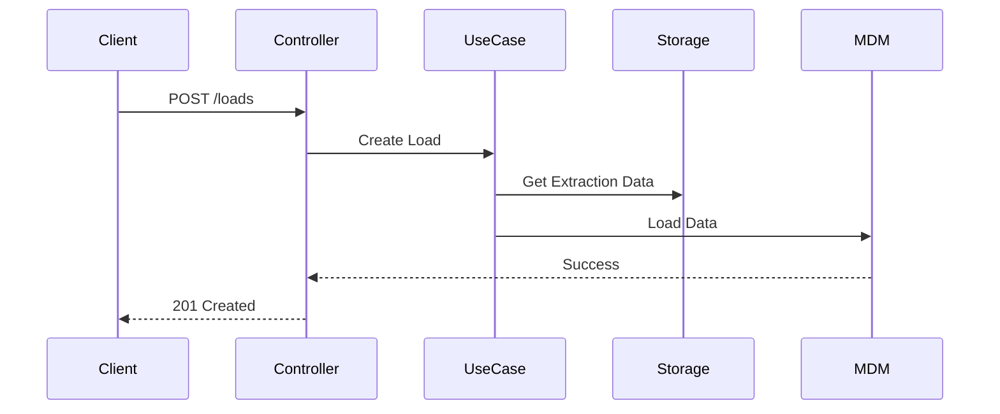

# DEM Service Architecture

## System Overview

The DEM (Data Extraction and Management) service is designed to extract data from various external sources and manage the extraction process. It follows a clean architecture pattern and integrates with the MDM (Master Data Management) service for data storage.

## Clean Architecture Implementation

The service follows clean architecture principles, separating concerns into distinct layers:

1. **Strategies Layer**: Source-specific extraction logic
2. **Use Cases Layer**: Application-specific business rules
3. **Interface Layer**: External interfaces (API, file system)
4. **Infrastructure Layer**: Technical implementations

### Project Structure

```
dem/
├── application/           # Application layer
│   ├── strategies/       # Data extraction strategies
│   ├── use_cases/        # Business use cases
│   └── __init__.py
├── config/               # Configuration
│   ├── api/             # API configuration
│   ├── database.py      # Database configuration
│   ├── logging_config.py # Logging configuration
│   └── __init__.py
├── infra/               # Infrastructure layer
│   ├── entrypoint/      # Controllers and routes
│   ├── repositories/    # Data persistence
│   └── __init__.py
├── docs/                # Documentation
│   └── swagger.yml      # API documentation
├── logs/                # Application logs
├── extractions/         # Extraction data storage
├── build/               # Build artifacts
├── requirements.txt     # Python dependencies
├── Dockerfile          # Container definition
├── Makefile           # Build automation
└── run.py             # Application entry point
```

## Component Layers

### 1. Strategies Layer (`application/strategies/`)

Contains source-specific extraction implementations:
- One strategy per data source
- Handles data format conversion
- Manages source-specific error handling

Example strategy:
```python
class RestCountriesStrategy:
    def __init__(self, api_client):
        self.api_client = api_client

    async def extract(self) -> List[dict]:
        """Extract country data from RestCountries API"""
        raw_data = await self.api_client.get_all_countries()
        return self.transform_data(raw_data)

    def transform_data(self, raw_data: List[dict]) -> List[dict]:
        """Transform raw API data to MDM format"""
        return [{
            'country_name': country['name']['common'],
            'numeric_code': country['ccn3'],
            'capital_city': country['capital'][0],
            'population': country['population'],
            'area': country['area']
        } for country in raw_data]
```

### 2. Use Cases Layer (`application/use_cases/`)

Implements application-specific business rules:
- Extraction management
- Data validation
- Load process orchestration

Example use case:
```python
class CreateExtraction:
    def __init__(self, strategy_factory, repository):
        self.strategy_factory = strategy_factory
        self.repository = repository

    async def execute(self, source: str) -> dict:
        strategy = self.strategy_factory.get_strategy(source)
        extraction_id = self.repository.create_extraction(source)
        
        try:
            data = await strategy.extract()
            self.repository.save_extraction_data(extraction_id, data)
            return {"extraction_id": extraction_id, "status": "completed"}
        except Exception as e:
            self.repository.update_extraction_status(extraction_id, "failed")
            raise ExtractionError(str(e))
```

### 3. Infrastructure Layer (`infra/`)

Handles technical details:
- HTTP request handling
- File system operations
- External service integration
- Data persistence

Example controller:
```python
@app.route("/source/<source>/extractions", methods=["POST"])
async def create_extraction(source):
    use_case = CreateExtraction(strategy_factory, repository)
    result = await use_case.execute(source)
    return jsonify(result), 201
```

### 4. Configuration Layer (`config/`)

Manages application settings:
- Environment configuration
- API configuration
- Dependency injection
- Strategy registration

## Service Integration



## Data Flow

### 1. Extraction Flow


### 2. Load Flow


## Design Patterns

1. **Strategy Pattern**
   - Encapsulates source-specific logic
   - Enables easy addition of new sources
   - Standardizes extraction interface

2. **Factory Pattern**
   - Creates strategy instances
   - Manages strategy registration
   - Simplifies strategy selection

3. **Repository Pattern**
   - Abstracts data persistence
   - Manages file system operations
   - Handles extraction metadata

## Error Handling

Implements a hierarchical error system:
```python
class ExtractionError(Exception):
    """Base class for extraction errors"""
    pass

class SourceNotFoundError(ExtractionError):
    """Raised when source is not found"""
    pass

class TransformationError(ExtractionError):
    """Raised when data transformation fails"""
    pass
``` 