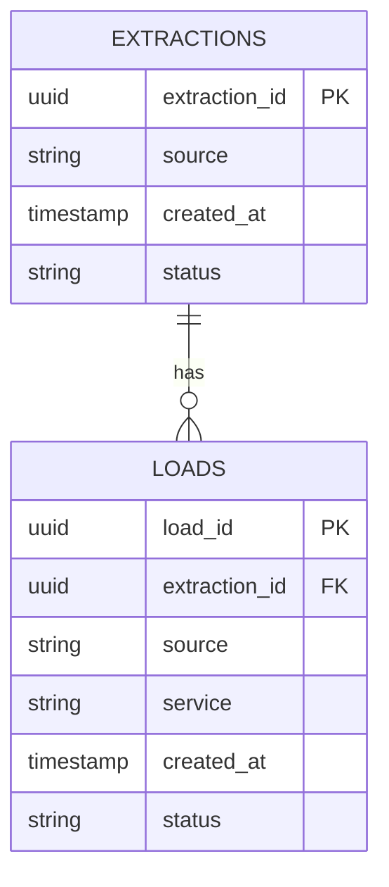

# DEM Database Schema

## Overview

The DEM (Data Extraction and Management) service uses a PostgreSQL database to store extraction and load process metadata. The actual extracted data is stored in the file system, while the database maintains the process tracking and status information.

## Tables

### Extractions Table

Stores metadata about data extraction processes from various sources.

```sql
CREATE TABLE extractions (
    extraction_id UUID PRIMARY KEY DEFAULT uuid_generate_v4(),
    source VARCHAR NOT NULL,
    created_at TIMESTAMP DEFAULT CURRENT_TIMESTAMP,
    status VARCHAR NOT NULL
);

-- Recommended indexes for performance optimization
CREATE INDEX idx_extractions_source ON extractions(source);
CREATE INDEX idx_extractions_status ON extractions(status);
CREATE INDEX idx_extractions_created_at ON extractions(created_at);
```

#### Field Descriptions

| Field         | Type      | Description                           | Constraints    |
|--------------|-----------|---------------------------------------|----------------|
| extraction_id | UUID      | Unique identifier for extraction      | PRIMARY KEY    |
| source       | VARCHAR   | Source of the extraction (e.g., restcountries) | NOT NULL |
| created_at   | TIMESTAMP | When extraction was created           | DEFAULT NOW()  |
| status       | VARCHAR   | Current status of extraction          | NOT NULL       |

### Loads Table

Tracks data loading processes from extractions to target services.

```sql
CREATE TABLE loads (
    load_id UUID PRIMARY KEY DEFAULT uuid_generate_v4(),
    extraction_id UUID REFERENCES extractions(extraction_id),
    source VARCHAR NOT NULL,
    service VARCHAR NOT NULL,
    created_at TIMESTAMP DEFAULT CURRENT_TIMESTAMP,
    status VARCHAR NOT NULL
);

-- Recommended indexes for performance optimization
CREATE INDEX idx_loads_extraction_id ON loads(extraction_id);
CREATE INDEX idx_loads_status ON loads(status);
CREATE INDEX idx_loads_created_at ON loads(created_at);
```

#### Field Descriptions

| Field          | Type      | Description                           | Constraints    |
|---------------|-----------|---------------------------------------|----------------|
| load_id       | UUID      | Unique identifier for load process    | PRIMARY KEY    |
| extraction_id | UUID      | Reference to extraction               | FOREIGN KEY    |
| source        | VARCHAR   | Source of the data                    | NOT NULL       |
| service       | VARCHAR   | Target service (e.g., mdm)           | NOT NULL       |
| created_at    | TIMESTAMP | When load was created                | DEFAULT NOW()  |
| status        | VARCHAR   | Current status of load process        | NOT NULL       |

## Entity Relationship Diagram



## Common Queries

### Get Latest Extraction Status

```sql
SELECT 
    extraction_id,
    source,
    status,
    created_at
FROM extractions
WHERE source = :source
ORDER BY created_at DESC
LIMIT 1;
```

### Get Pending Loads

```sql
SELECT 
    l.*,
    e.source
FROM loads l
JOIN extractions e ON l.extraction_id = e.extraction_id
WHERE l.status = 'pending'
ORDER BY l.created_at ASC;
```

### Get Failed Extractions

```sql
SELECT 
    extraction_id,
    source,
    created_at
FROM extractions
WHERE status = 'failed'
AND created_at >= NOW() - INTERVAL '24 hours';
```

## Performance Optimization

### Recommended Indexes

1. **Extractions Table**
   - `idx_extractions_source`: Optimize source-based queries
   - `idx_extractions_status`: Filter by status efficiently
   - `idx_extractions_created_at`: Time-based queries and sorting

2. **Loads Table**
   - `idx_loads_extraction_id`: Join optimization
   - `idx_loads_status`: Status filtering
   - `idx_loads_created_at`: Time-based queries and sorting

### Query Optimization

1. **Status Updates**
```sql
UPDATE extractions
SET status = :new_status
WHERE extraction_id = :extraction_id
RETURNING *;
```

2. **Extraction Summary**
```sql
SELECT 
    source,
    status,
    COUNT(*) as count,
    MAX(created_at) as latest_extraction
FROM extractions
WHERE created_at >= NOW() - INTERVAL '7 days'
GROUP BY source, status;
```

## Maintenance

### Cleanup Old Records

```sql
-- Archive completed extractions older than 30 days
CREATE TABLE extractions_archive (LIKE extractions);

INSERT INTO extractions_archive
SELECT * FROM extractions
WHERE created_at < NOW() - INTERVAL '30 days';

DELETE FROM extractions
WHERE created_at < NOW() - INTERVAL '30 days';
```

### Monitor Table Growth

```sql
SELECT 
    schemaname,
    relname as table_name,
    n_live_tup as row_count,
    pg_size_pretty(pg_total_relation_size(relid)) as total_size
FROM pg_stat_user_tables
WHERE schemaname = 'public'
ORDER BY n_live_tup DESC;
``` 