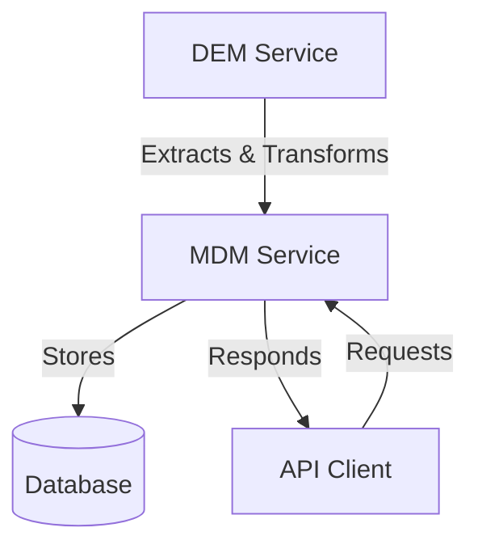
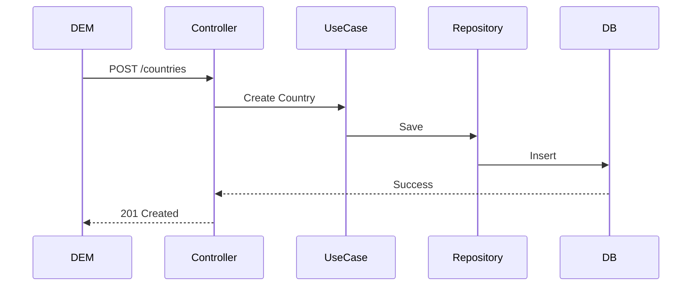
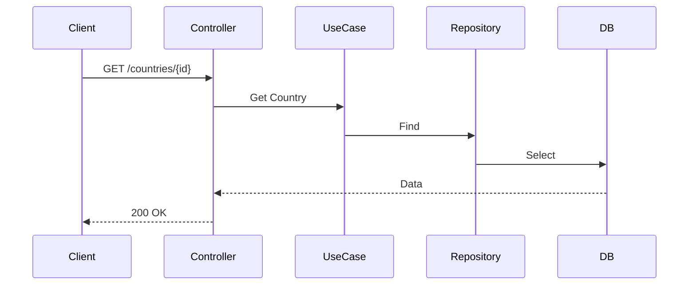

# MDM Service Architecture

## System Overview

The MDM (Master Data Management) service is designed to manage and provide access to country and currency data. It follows a clean architecture pattern and integrates with the DEM (Data Extraction and Management) service for data ingestion.

## Clean Architecture Implementation

The service follows clean architecture principles, separating concerns into distinct layers:

1. **Domain Layer**: Core business logic
2. **Use Cases Layer**: Application-specific business rules
3. **Interface Layer**: External interfaces (API, database)
4. **Infrastructure Layer**: Technical implementations

### Project Structure

```
mdm/
├── application/         # Application layer
│   ├── domain/         # Business entities and rules
│   │   └── entity/     # Domain entities
│   ├── errors/         # Custom exceptions
│   └── usecase/        # Business use cases
├── config/             # Configuration
│   ├── api/           # API configuration
│   ├── db/            # Database settings
│   └── injector/     
├── infra/             # Infrastructure layer
│   ├── entrypoint/    # Controllers and routes
│   └── repository/    # Data persistence
├── docs/              # Documentation
├── logs/              # Application logs
├── build/             # Build artifacts
├── requirements.txt   # Python dependencies
├── Dockerfile         # Container definition
├── Makefile          # Build automation
├── alembic.ini       # Database migrations config
└── run.py            # Application entry point
```

## Component Layers

### 1. Domain Layer (`application/domain/`)

The core of the application, containing:
- Business entities (Country, Currency)
- Business rules and validations
- Domain interfaces
- Custom exceptions

Example domain entity:
```python
class Country:
    def __init__(self, name: str, numeric_code: int, capital: str, 
                 population: int, area: float):
        self.name = name
        self.numeric_code = numeric_code
        self.capital = capital
        self.population = population
        self.area = area

    def validate(self) -> bool:
        if not self.name or not self.numeric_code:
            return False
        return True
```

### 2. Use Cases Layer (`application/usecases/`)

Implements application-specific business rules:
- One class per use case
- Orchestrates domain entities
- Independent of external frameworks

Example use case:
```python
class CreateCountry:
    def __init__(self, country_repository):
        self.repository = country_repository

    def execute(self, country_data: dict) -> Country:
        country = Country(**country_data)
        if not country.validate():
            raise ValidationError("Invalid country data")
        return self.repository.create(country)
```

### 3. Infrastructure Layer (`infra/`)

Handles technical details:
- HTTP request handling
- Database operations
- External service integration
- Framework-specific code

Example controller:
```python
@app.route("/countries", methods=["POST"])
def create_country():
    data = request.get_json()
    use_case = CreateCountry(country_repository)
    country = use_case.execute(data)
    return jsonify(country.to_dict()), 201
```

### 4. Configuration Layer (`config/`)

Manages application settings:
- Environment configuration
- Database connection
- API routes
- Dependency injection

## Service Integration



## Data Flow

### 1. Data Ingestion Flow


### 2. Data Retrieval Flow


## Design Patterns

1. **Repository Pattern**
   - Abstracts data persistence
   - Enables swappable implementations
   - Centralizes data access logic

2. **Dependency Injection**
   - Decouples components
   - Facilitates testing
   - Manages dependencies

3. **Factory Pattern**
   - Creates use case instances
   - Manages dependencies
   - Simplifies object creation

## Error Handling

Implements a hierarchical error system:
```python
class DomainError(Exception):
    """Base class for domain errors"""
    pass

class ValidationError(DomainError):
    """Raised when validation fails"""
    pass

class NotFoundError(DomainError):
    """Raised when resource not found"""
    pass
```
