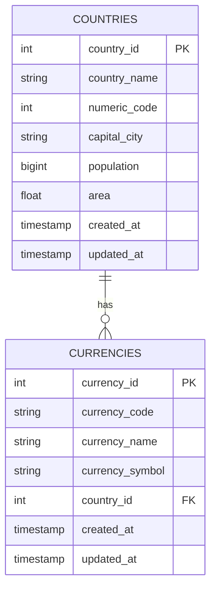

# MDM Database Schema

## Overview

The MDM service uses a PostgreSQL database to store country and currency information. The schema is designed to maintain referential integrity between countries and their currencies while optimizing for common query patterns.

## Tables

### Countries Table

Stores comprehensive information about countries.

```sql
CREATE TABLE countries (
    country_id SERIAL PRIMARY KEY,
    country_name VARCHAR NOT NULL,
    numeric_code INTEGER NOT NULL,
    capital_city VARCHAR NOT NULL,
    population BIGINT NOT NULL,
    area FLOAT NOT NULL,
    created_at TIMESTAMP DEFAULT NOW(),
    updated_at TIMESTAMP DEFAULT NOW()
);

-- Recommended indexes for performance optimization
CREATE INDEX idx_countries_numeric_code ON countries(numeric_code);
CREATE INDEX idx_countries_name ON countries(country_name);
```

#### Field Descriptions

| Field         | Type      | Description                           | Constraints    |
|--------------|-----------|---------------------------------------|----------------|
| country_id    | SERIAL    | Auto-incrementing primary key         | PRIMARY KEY    |
| country_name  | VARCHAR   | Official name of the country          | NOT NULL       |
| numeric_code  | INTEGER   | ISO numeric country code              | NOT NULL       |
| capital_city  | VARCHAR   | Name of the capital city             | NOT NULL       |
| population    | BIGINT    | Total population                      | NOT NULL       |
| area          | FLOAT     | Total area in square kilometers       | NOT NULL       |
| created_at    | TIMESTAMP | Record creation timestamp            | DEFAULT NOW()  |
| updated_at    | TIMESTAMP | Last update timestamp                | DEFAULT NOW()  |

### Currencies Table

Stores currency information with relationships to countries.

```sql
CREATE TABLE currencies (
    currency_id SERIAL PRIMARY KEY,
    currency_code VARCHAR NOT NULL,
    currency_name VARCHAR NOT NULL,
    currency_symbol VARCHAR NOT NULL,
    country_id INTEGER NOT NULL REFERENCES countries(country_id) ON DELETE CASCADE,
    created_at TIMESTAMP DEFAULT NOW(),
    updated_at TIMESTAMP DEFAULT NOW()
);

-- Recommended indexes for performance optimization
CREATE INDEX idx_currencies_code ON currencies(currency_code);
CREATE INDEX idx_currencies_country_id ON currencies(country_id);
```

#### Field Descriptions

| Field          | Type      | Description                           | Constraints    |
|---------------|-----------|---------------------------------------|----------------|
| currency_id    | SERIAL    | Auto-incrementing primary key         | PRIMARY KEY    |
| currency_code  | VARCHAR   | ISO currency code (e.g., USD)         | NOT NULL       |
| currency_name  | VARCHAR   | Full name of the currency             | NOT NULL       |
| currency_symbol| VARCHAR   | Currency symbol (e.g., $)             | NOT NULL       |
| country_id     | INTEGER   | Reference to countries table          | FOREIGN KEY, NOT NULL |
| created_at     | TIMESTAMP | Record creation timestamp            | DEFAULT NOW()  |
| updated_at     | TIMESTAMP | Last update timestamp                | DEFAULT NOW()  |

## Entity Relationship Diagram



## Common Queries

### Get Country with Currencies

```sql
SELECT 
    c.*,
    json_agg(cur.*) as currencies
FROM countries c
LEFT JOIN currencies cur ON c.country_id = cur.country_id
WHERE c.numeric_code = :code
GROUP BY c.country_id;
```

### Find Currency by Code

```sql
SELECT 
    cur.*,
    c.country_name
FROM currencies cur
JOIN countries c ON cur.country_id = c.country_id
WHERE cur.currency_code = :code;
```

### Update Country Population

```sql
UPDATE countries
SET 
    population = :new_population,
    updated_at = CURRENT_TIMESTAMP
WHERE numeric_code = :code
RETURNING *;
```

## Performance Optimization

### Recommended Indexes

1. **Countries Table**
   - `idx_countries_numeric_code`: Optimizes lookups by ISO numeric code
   - `idx_countries_name`: Improves country name search performance

2. **Currencies Table**
   - `idx_currencies_code`: Optimizes currency code lookups
   - `idx_currencies_country_id`: Improves JOIN performance with countries

### Query Optimization

1. **Batch Inserts**
```sql
INSERT INTO countries (country_name, numeric_code, capital_city, population, area)
VALUES 
    ('Brazil', 76, 'Brasília', 214300000, 8515770.0),
    ('Canada', 124, 'Ottawa', 38250000, 9984670.0)
RETURNING country_id;
```

## Maintenance

### Update Statistics

```sql
ANALYZE countries;
ANALYZE currencies;
```

### Vacuum Tables

```sql
VACUUM ANALYZE countries;
VACUUM ANALYZE currencies;
```

### Monitor Index Usage

```sql
SELECT 
    schemaname,
    tablename,
    indexname,
    idx_scan,
    idx_tup_read,
    idx_tup_fetch
FROM pg_stat_user_indexes
WHERE schemaname = 'public'
ORDER BY idx_scan DESC;
``` 